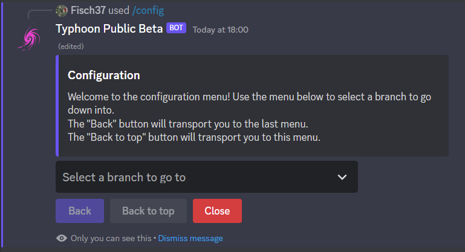
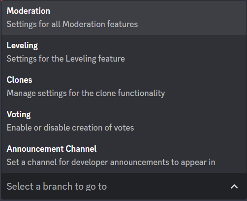
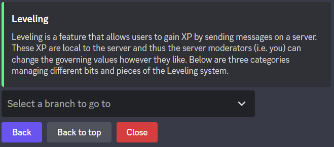
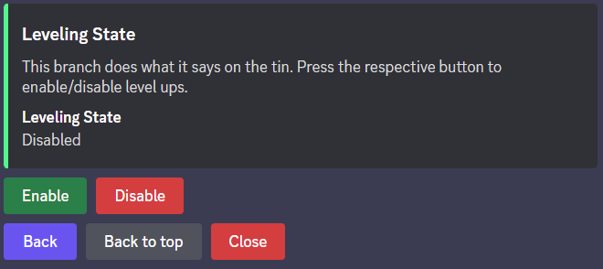

Configuring the Bot
=================================================

To allow easy use of the bot Typhoon comes with the command ``/config``.
Using the UI provided by the command you can edit almost all of the bot's settings.
Some settings such as those provided by ``/lock`` are not available since they reference specific channels.
The config menu uses a few terms such as *branch*. A branch is just a submenu within the config system.

.. note:: 
    This chapter does not show all possible configuration options.
    These options will be explained within their respective categories.

Traversing the config menu
***************************************

To select a new branch, use the select menu and click on the branch you want.
Each branch comes with a title and a *brief*. A brief is a short description of the branche's use.

.. note:: 
    Branches are not always equivalent to the categories of ``/help``.

You may have noticed the buttons "Back" and "Back to top" not being activated in the main menu.
These buttons allow you to travel up the configuration tree, allowing you to go back to a previous branch.
"Back" sends you back to the previous higher branch, while "Back to top" sends you to the main menu.

Appearances of Branches and Elements
***************************************

Every branch comes with a description, which is different from its brief.
A description is usually more detailed and ** if required ** explain what the subbranches do.

Some branches do not have subbranches. Internally, these are called *elements*.
Elements manage specific settings of the bot. 
Similarly to branches, elements have a description that intructs you on how to use them.