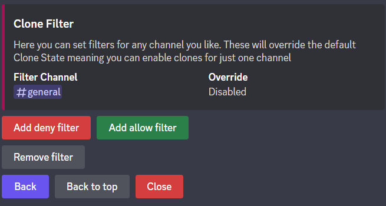

Fun
=================================================
This category includes a mixed assortment of more or less useless commands to entertain yourself and others.

Cloning
***************************************

This feature allows you to create a near-perfect copy of yourself.
The clone will send the same messages you send across all channels where cloning is enabled.
However, this feature is disabled by default, which means a server moderator will have to enable it first.

Managing the Cloning feature
~~~~~~~~~~~~~~~~~~~~~~~~~~~~~~~~~~~~
The cloning feature can be easily managed using ``/config``. 
For help regarding this command, look :ref:`here <config_command:configuring the bot>`.

.. note:: 
    Changing the permissions of ``/clone`` will not work to configure the cloning system.
    This would only disable use of the command, however, a user's cloning state is changed per server, meaning members could go to a channel where the command is enabled and then use the feature in all channels, regardless of the command setting.

Global enabling and disabling
-------------------------------
If you already know how the command works, go to *Clones>Clone State*.
Here you will find two buttons "Enable" and "Disable". 
These set the global cloning feature. 
If cloning is enabled, users can use the feature anywhere, so long as no filter overrides this setting.

Setting filters
--------------------------------

Often times moderators want features like cloning to only be enabled in certain channels.
This is implemented using so-called filters.
These filters override the global setting, meaning you can allow use of clones in #spam, while it is disabled everywhere else.

To create such a filter use ``/config`` and navigate to *Clones>Clone Filter*.
There you will find three buttons.
The button "Add deny filter" allows you to disable cloning in a certain channel, "Add allow filter" allows you to enable it.
Using "Remove filter" you can remove an existing filter.

Disabling cloning in one channel also renders ``/clone`` useless. 
Clones enabled outside the channel will not work within a channel that has disabled cloning.

Using cloning
--------------------------------
To use the cloning feature, use ``/clone`` in a channel where cloning is enabled (either by the global state or filters)
with ``state: True``. Cloning is now enabled for you specifically on the current server.
To disable the feature use ``/clone`` with ``state: False``.

Tableshrug
***************************************
A tableshrug (┻━┻¯\\_(ツ)_/¯┻━┻) is a combination of ``/shrug`` and ``/tableflip``.
The ``/tableshrug`` command uses webhooks to allow you to send a message with a tableshrug attached at the end.
Use it for when you are really mad but pretend to be perfectly calm... or just as a joke.

Passing the Burrito
***************************************
.. image:: https://cdn.discordapp.com/attachments/734461254747553826/754372969890840627/image0-29.gif
    :alt: Passing down the burrito. Sadly you can't see that. Instead, have this cat: 🐈

Do you know that feeling when you just want to be nice to people and offer a burrito?
No? That's too bad. But for everyone else: Use ``/passtheburrito <amount>`` to pass the burrito down.

Patting & Cuddling
***************************************

There are some things in life that all people should enjoy. I think cuddles are one of them, which is why I made these two commands.
Use ``/patpat <target> [<comment>]`` and ``/cuddle <target> [<comment>]`` to hand out pats and cuddles respectively.

You have to specify a server member as a target and can optionally add a comment that will be sent within the message.

The targeted member may use the button below the bot's post to respond with another cuddle/pat.
This response cannot be directly responded to.