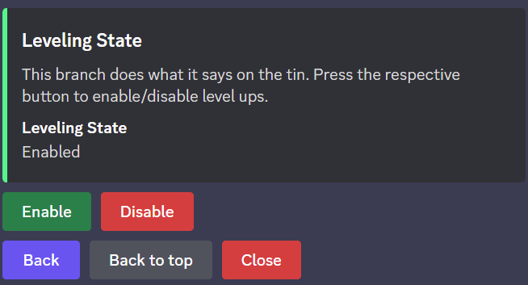
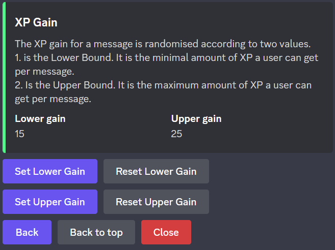
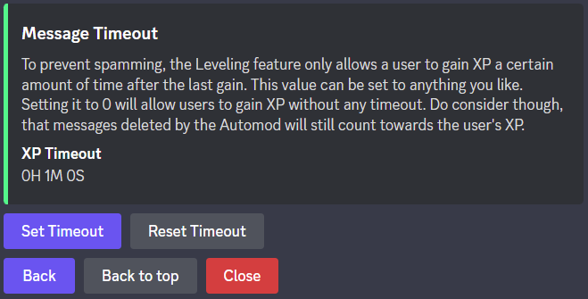
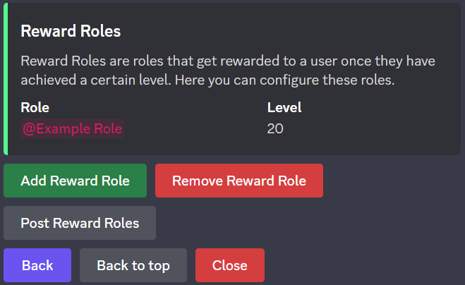
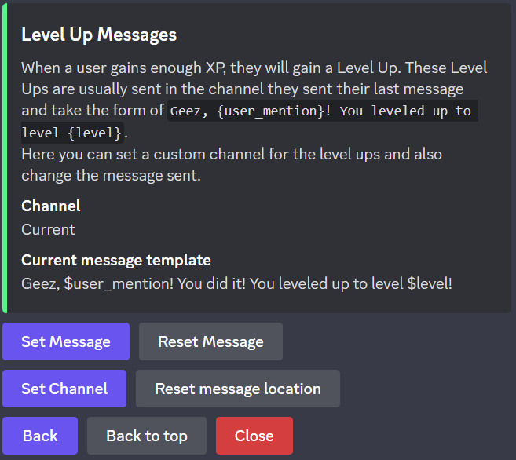

Leveling
*************************************************
The leveling system is a per-server activity-based reward system for members of your server. 
It needs to be enabled by a moderator, before being used, a guide for which you will find :ref:`here <leveling:enabling leveling>`.

For :ref:`every* <leveling:managing xp gains>` message sent, the member gains a randomised, configurable amount of experience points.
To learn how to configure this amount, see :ref:`leveling:managing xp gains`

As soon as a member has a certain amount of XP, they will achieve a new *level*.
Levels don't do anything, besides cause the bot to send congratulations and triggering *Reward Roles*.

The message sent by the bot upon a levelup may be configured to fit your needs.
For that, see :ref:`leveling:customised level up messages`.

A Reward Role is, as previously stated, a role a member will be granted automatically upon achieving a certain level.
To configure a Reward Role, see :ref:`leveling:setting up reward roles`.

Enabling Leveling
~~~~~~~~~~~~~~~~~~~~~~~~~~~~~~~~~~~~~~~
Enabling leveling can be done by use of the ``/config`` command.
If you are unfamilier with the menu provided by it, see :ref:`this <config_command:configuring the bot>`.

If you are familiar with it, head to *Leveling > Leveling State*.
There you will find the two buttons "Enable" and "Disable". These do exactly what they sound like.
All you need to do now is click on "Enable" and confirm that leveling is enabled.

Viewing your and other's XP
~~~~~~~~~~~~~~~~~~~~~~~~~~~~~~~~~~~~~~~
There are two commands that allow you to see xp statistics.
The first is ``/level [<user>]``, which allows you to see a server member's experience points and level.
This command can be executed without setting the user argument, in which case your own statistics will be shown.
If the argument is set to a server member, that member's statistics will be shown.

You may also want to see the statistics of everyone on a server at once.
For this, there is ``/leaderboard``. This command will give you a list of all members that have gained xp
ordered by the xp they have earned. 

Managing XP Gains
~~~~~~~~~~~~~~~~~~~~~~~~~~~~~~~~~~~~~~~
Managing xp gains is achieved by use of ``/config``. 
If you are unfamiliar with this command, read :ref:`config_command:configuring the bot`,
otherwise continue reading.

Configuring Randomised Gains
-------------------------------
The bot decides the amount of xp gained for a certain message by a random generator within two values you can configure yourself.
These are the lower bound and upper bound. 
As you may think, the lower bound is the smallest amount of xp a user will get for a message
and the upper bound is the largest possible amount a user will get for a single message.

You may configure these in the config menu under *Leveling > XP Gain*.
There you will find four buttons arranged in pairs of two.
With the buttons in the first column you can set the relevant bound to a value of your choosing,
while the second column buttons allow you to reset the bounds to their default values.

.. note:: 
    You may not choose a configuration in which the following conditions are violated:
        1. The lower bound may not exceed the upper bound.
        2. Neither of the bounds may be less than 0.
        3. Both bounds must be whole numbers.
        4. Neither of the bounds may exceed 255.
    
    Any configuration violating one or more of these rules, will not be accepted.

Configuring Message Timeouts
-------------------------------
The message timeout is the distance in time between two messages of the same user that will cause an xp gain.
If you are on a server with few people that do not usually spam, you may find it reasonable to decrease this value.
Servers with many people might want to increase this value to aid against spamming.

To configure this option go to *Leveling > Message Timeout* of the ``/config`` command.
There you will find two buttons, one allowing you to set a timeout, the other one resetting it to the default value.

A timeout may be specified using the following format: ``<hours>H<minutes>M<seconds>S``
This means a timeout of 1 hour 23 minutes and 4 seconds would be sent as the following: ``1H23M4S``
You may choose not to pass a certain time unit, meaning ``5M`` is completely valid despite it missing hour and second declarations.
Furthermore, minutes and seconds are not limited by their usual value range, allowing ``600S`` instead of ``10M``.

Setting up Reward Roles
~~~~~~~~~~~~~~~~~~~~~~~~~~~~~~~~~~~~~~~

Setting up a Reward Role works using ``/config`` by heading to *Leveling > Reward Roles*.
The buttons "Add Reward Role" and "Remove Reward Role" allow you to add or remove a reward role.
The third option "Post Reward Roles" will post a message describing **all** reward roles publicly in the current channel.

Customised Level Up Messages
~~~~~~~~~~~~~~~~~~~~~~~~~~~~~~~~~~~~~~~

Using ``/config`` you can customise the message sent when a user receives a levelup (i.e. incresing in level).
You can also customise the channel where the level up message is sent. This is set to "Current" by default, which means that the message will be sent in the channel of the message that caused the levelup.

The branch required is *Leveling > Level Up Messages* and features two rows with two buttons.

The first row 

The second row allows you to set the channel. If you wish to set it to "Current", use "Reset message location".

The first row allows you to customise the level up message.
This is done using a *template*. This is a generalised expression of the message that will be applied for every message.
A template may feature variables, which are replaced by their respective values for messages being sent.
A variable must be preceeded by a $. You can still use $ without issues, just be careful not to write variables.
The following variables are accepted:

+----------------+-------------------------------------------------------------------------------------------------------------------------------------+
| Variable Name  | Description                                                                                                                         |
+================+=====================================================================================================================================+
| user_name      | The username. This does not change with the nickname and does not mention the user.                                                 |
+----------------+-------------------------------------------------------------------------------------------------------------------------------------+
| user_nick      | The nickname of a user. This may change with the server and does not mention the user.                                              |
+----------------+-------------------------------------------------------------------------------------------------------------------------------------+
| user_mention   | This is the mention of the user.                                                                                                    |
+----------------+-------------------------------------------------------------------------------------------------------------------------------------+
| server_name    | The name of the current server.                                                                                                     |
+----------------+-------------------------------------------------------------------------------------------------------------------------------------+
| server_members | The amount of members on the server.                                                                                                |
+----------------+-------------------------------------------------------------------------------------------------------------------------------------+
| level          | The new level of the user.                                                                                                          |
+----------------+-------------------------------------------------------------------------------------------------------------------------------------+
| xp             | The xp of the user.                                                                                                                 |
+----------------+-------------------------------------------------------------------------------------------------------------------------------------+
| rank           | The rank of the user on the leaderboard.                                                                                            |
+----------------+-------------------------------------------------------------------------------------------------------------------------------------+
| channel        | The channel the user has sent the message in that caused the levelup. This is not necessarily the channel the message appears in.   |
+----------------+-------------------------------------------------------------------------------------------------------------------------------------+
| send_channel   | The channel the levelup message will be sent in                                                                                     |
+----------------+-------------------------------------------------------------------------------------------------------------------------------------+