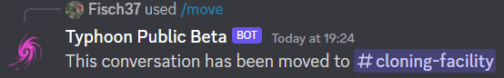

Moderation
=================================================
Logging
***************************************
The logging system is an automised event watcher, that keeps track of events occuring on your server.
Events are to be understood not as the Discord Events available on community servers,
but instead as changes to the server or message history potentially relevant for moderation.

Setting up logging can be done using ``/config``. If you are unfamiliar with this command, see :ref:`config_command:configuring the bot`.
If you are familiar with it, head to *Moderation>Logging*.
First you will need to set a channel for any events to be logged in. Use the "Set Channel" button to achieve this.
Then use the select menu above the buttons to select the events you wish to log. The following event categories are supported:

    + Moderation: Logging of Automod or member kicks/bans
    + Channels: Log changes to channels (creation, deletion, etc.)
    + Server Updates: Log changes regarding the server (e.g. name, security, emojis/stickers)
    + Invites: Log creation/deletion of invites
    + Member Changes: Log changes to the members (joins, leaves, profile changes)
    + Messages: Log message changes (deletion/edits)
    + Reaction Moderation: Log moderation actions related to reactions
    + Roles: Log changes to the roles of this server
    + Thread Moderation: Log changes to threads

If you want to disable logging, simply click the "Disable" button next to "Set Channel"

Auto Moderation
***************************************
Automatic Moderation (short: Automod) is a feature allowing Typhoon to moderate common issues taking some load off the moderators.
This feature includes moderation of caps spam (e.g. ``HELLO! READ MY MESSAGES!``), regular spam (i.e. repeatedly sending a similar message), and emoji spam (e.g. ``😂😎👌😜❤❤😆😏``).
This feature can be configured using ``/config``. If you are unfamiliar with the workings of this command, see :ref:`config_command:configuring the bot`.

Setting it up
~~~~~~~~~~~~~~~~~~~~~~~~~~~~~~~~~~~~

Head to ``/config``'s *Moderation>Automod* and select the option you want to configure. (If you want to configure multiple, repeat this with the relevant feature).
Click the button "Enable" and select "Delete Message" in the select menu.

Boom! Now the feature of your choice is enabled with the default configuration.
If you want to change when a message is detected, read the instructions on the relevant config branch.

Immunity roles
~~~~~~~~~~~~~~~~~~~~~~~~~~~~~~~~~~~~

Sometimes you want certain people (like moderators) to not be affected by Automod.
For this, Typhoon offers "God Roles". Any member with at least one God Role will not be considered for Automod.
To add or remove God Roles head to *Moderation>God roles* of ``/config``.
To add a new role, use the "Add" button, to remove a role, use "Remove".

Warning System
***************************************
Warnings are special events intended to serve as a notice to the moderators.
There are two things that may trigger a warning: Automod features with the "Warn Member" consequence enabled and the command ``/warn``.

A warning will be logged in the logging channel given that the "Automod" event category is enabled. For more information on this, see :ref:`moderation:logging`.
It features the targeted member, an optional reason, an author notice, and a date.

You may hand out warnings manually using ``/warn <target> [<reason>]`` as was mentioned previously.
With this command a warning is created authored by you addressed at the target with an optional reason.
It will be timestamped to the current time.

Locking Channels
***************************************
Is the situation really escalating in a certain channel? Do you feel like your moderators aren't being listened to?
In this case, you might want to temporarily remove everyone's write permissions in that channel.

This is what ``/lock`` achieves with its subcommands ``/lock set`` and ``/lock remove``.
The bot will also send an announcement in that channel to notify of the lock.

.. note:: 
    This feature is a shorthand for removing the Send Messages permission from @everyone.
    It will not work when @everyone did not have this permission to begin with.

Moving Messages
***************************************
This feature allows you to move the last n messages of the current channel to another channel.
It has one command ``/move <channel> <messages>``. You may move up to 100 messages at a time.
Moved messages will be grouped together into as few messages as possible.

.. warning:: 
    There is no support for images, embeds or videos in this feature. 
    If you attempt to move a message that has this, the relevant attachment **will** be deleted.
    (This does not apply to links, these will still work as expected.)

Mass-deleting Messages
***************************************
If you find yourself overwhelmed by spam, you might wish to delete a lot of messages at once.
``/purge <messages>`` allows you to delete the last n messages permanently.
The maximum messages that will be deleted at once is 100.