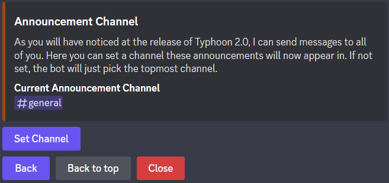
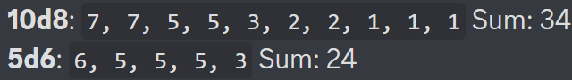
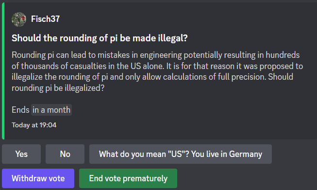
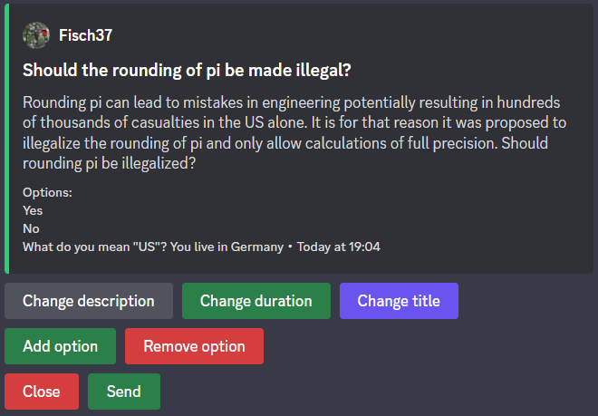

Utility
=================================================
Bot Announcements
***************************************
With this version of the bot, you may be notified of important changes via a message.
Announcements will be sent in the *Announcement Channel* or the first channel in the order.

.. note:: 
    The Announcement Channel is unrelated to the Discord channel type "Announcement".

If you wish to set a custom channel for announcements to appear in, you can use the ``/config`` command to do that.
If you are unfamiliar with the ``/config`` command, read :ref:`config_command:configuring the bot`, otherwise continue reading.

If you are familiar with the command, use the *Announcement Channel* branch 
and use the ``Set Channel`` button to change the Announcement Channel.

Inviting the Bot
***************************************
Inviting the bot is quite simple. Just use ``/invite`` and click the link in the reply.
On new versions of Discord applications, this will open in the application.
Older versions will open the link in a browser.

Rolling dice
***************************************
Rolling dice is done via the command ``/roll <die> [<sort>]``.

The *die* argument is expressed in the format of ``<n>d<f>``, 
where n is the amount of dice and f is the highest possible value.
The dice is implied to have 1 as a lowest possible value.
You may also have multiple dice of this format, which will need to be seperated by ``+``.
The n-value is capped collectively at 100, f is capped at 500. The maximum dice types you can chain is 10.

The sort argument is an optional argument and will sort the results in decreasing order.

This is an example result of ``/roll 10d8+5d6 sort: true``:

Voting
***************************************

The voting feature allows you to perform anonymous polls of your community.

To create a vote use ``/vote create`` and follow the instructions.
After passing the initial *Modal*, you will see an editor, where you can change the options further. Here you will also need to specify the options.

The author of a vote also has the option to end it before the duration. 
While this button is visible to everyone, it won't work for anyone but the author.

After the vote is completed, the results will appear in a footer of the embed.

Scheduled Messages
***************************************
This feature allows you to schedule messages to be sent at a set point in the future.
The feature works by the command ``/schedule_msg <time> <content>``.

The ``time`` argument should to be of the format ``YYYY.MM.DD;HH:MM:SS``.
Instead of ``.`` you may also use one of the following seperators: "-" "." "/" ":" and " ".

.. note:: 
    Due to an API limitation all times need to be given in Universal Coordinated Time (UTC) or Greenwich Mean Time (GMT).
    Not obeying this will result in your message schedules being offset by up to 12 hours depending on your timezone.

Anonymous Messages
***************************************
You might want your users to be able to send messages without their name being visible.
For this, ``/send_anon <message>`` will work great. The command works as simple as you might think.
Simply write the message you want into the message argument and see the message pop up.

If you want to restrict or remove access to this feature, head into the integrations settings of your server and remove access to the command.